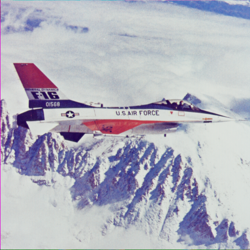

# self2self_pytorch

## Introduction
This is a pytorch implementation of [self2self](https://openaccess.thecvf.com/content_CVPR_2020/papers/Quan_Self2Self_With_Dropout_Learning_Self-Supervised_Denoising_From_Single_Image_CVPR_2020_paper.pdf), "Yuhui Quan, Mingqin Chen, Tongyao Pang, Hui Ji; Proceedings of the IEEE/CVF Conference on Computer Vision and Pattern Recognition (CVPR), 2020, pp. 1890-1898."

Simply run self2self.py:
```python
python self2self.py
```
The denoised images will be saved in images/, and the corresponding models will be saved in models/.

## Examples
The original image, noisy image, and the results after 2000, 20000, and 12600 iterations are shown below.




